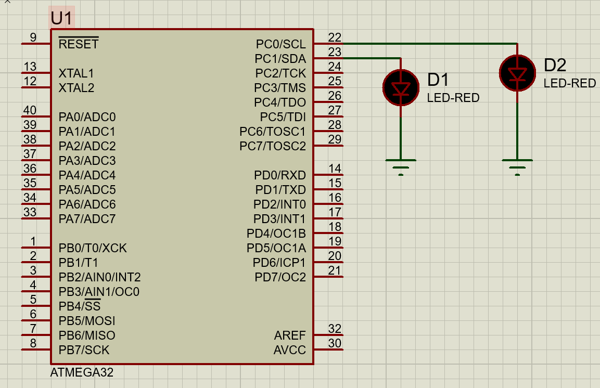
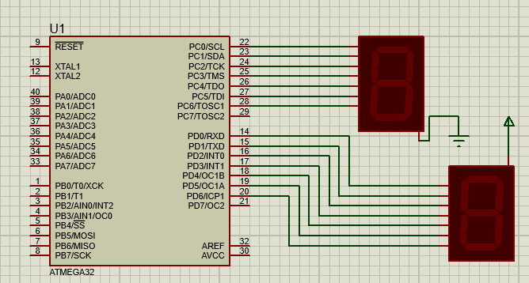

# ⚡ ATmega32 AVR Drivers – ITI Embedded Systems

[](https://www.microchip.com/en-us/product/ATmega32)
[](https://en.wikipedia.org/wiki/C_(programming_language))
[](#-layered-software-architecture)
[](LICENSE)

A fully modular, production-grade **C driver suite** for the **8-bit AVR ATmega32 microcontroller**.  
Built following standard **Layered Embedded Software Architecture** principles taught during the **ITI (Information Technology Institute)** Embedded Systems track.

---

## 📐 Layered Software Architecture

This repository separates low-level hardware registers from high-level application logic using a **4-tier design model**:

```
┌─────────────────────────────────────────┐
│           APP (Application)             │
│     main.c · System Integration         │
├─────────────────────────────────────────┤
│      HAL (Hardware Abstraction)         │
│   LED · SSD · LCD · KEYPAD · MOTOR      │
├─────────────────────────────────────────┤
│   MCAL (Microcontroller Abstraction)    │
│   DIO · EXTI · GIE · ADC · TIMER · ...  │
├─────────────────────────────────────────┤
│       LIB (Libraries / Common)          │
│   STD_Types · BIT_Math                  │
└─────────────────────────────────────────┘
```

### 1. LIB (Software Libraries)
Contains utility headers for standard data types and bit manipulations:

| File | Description |
|------|-------------|
| `STD_Types.h` | Standard integer type definitions (`u8`, `u16`, `u32`, `s8`, `s16`, `s32`, `f32`, `f64`, `bool`). |
| `BIT_Math.h` | Bitwise operation macros (`SET_BIT`, `CLR_BIT`, `TOG_BIT`, `GET_BIT`, `IS_BIT_SET`, `IS_BIT_CLR`). |

### 2. MCAL (Microcontroller Abstraction Layer)
Directly interacts with internal ATmega32 hardware peripherals:

| Module | Description |
|--------|-------------|
| **DIO** (GPIO) | Pin & Port direction setting, reading, and writing. |
| **EXTI** | External Interrupts (`INT0`, `INT1`, `INT2`) with configurable trigger modes. |
| **GIE** | Global Interrupt Enable control (SREG bit 7). |
| **ADC** | Analog-to-Digital Converter with single/chain conversion, polling, and interrupt capability. |
| **TIMER0 / TIMER1 / TIMER2** | Timers/Counters in Normal, CTC, Fast PWM, and Phase Correct PWM modes, plus Input Capture Unit (ICU). |
| **USART** | Serial asynchronous communication (TX/RX, polling, interrupts). |
| **SPI** | Serial Peripheral Interface (Master/Slave modes). |
| **TWI** (I²C) | Two-Wire Interface with master/slave transmitter and receiver modes. |
| **WDT** | Watchdog Timer control. |

### 3. HAL (Hardware Abstraction Layer)
Provides high-level APIs for external components connected to the microcontroller:

| Module | Description |
|--------|-------------|
| **LED** | LED initialization, ON/OFF, and toggle control. |
| **SSD** | Seven Segment Display driver (Common Anode & Common Cathode). |
| **LCD** | Character LCD (4-bit / 8-bit mode) driver for 16×2 / 20×4 screens. |
| **KEYPAD** | 4×4 matrix keypad scanner. |
| **SWITCH** | Abstraction driver for simple digital input peripherals. |
| **DC_MOTOR / STEPPER_MOTOR** | Motor direction and speed control interfacing via drivers like L293D / ULN2003. |

### 4. APP (Application Layer)
Contains `main.c` and system integration logic, utilizing HAL and MCAL services to execute target tasks.

---

## 📁 Repository Structure

```
AVR_Atmega32_ITI/
├── APP/
│   ├── DIO_test.c              # DIO driver test application
│   └── Seven_Segment.c         # Seven-Segment test application
├── HAL/
│   ├── LED/
│   │   ├── LED_Config.h
│   │   ├── LED_Interface.h
│   │   ├── LED_Private.h
│   │   └── LED_Program.c
│   └── SSD/
│       ├── SSD_Config.h
│       ├── SSD_Interface.h
│       ├── SSD_Private.h
│       └── SSD_Program.c
├── MCAL/
│   └── DIO/
│       ├── DIO_Config.h
│       ├── DIO_Interface.h
│       ├── DIO_Private.h
│       └── DIO_Program.c
├── LIB/
│   ├── STD_Types.h
│   └── BIT_Math.h
├── Hardware_Connection/
│   ├── LED_Simulation.PNG
│   └── 7_Segment_Simulation.PNG
├── .gitignore
├── LICENSE
└── README.md
```

---

## 📋 File Structure Design Rule

Each module inside **MCAL** and **HAL** strictly follows the **4-file structure pattern**:

| File Pattern | Description |
| :--- | :--- |
| `MODULE_Interface.h` | **Public API:** Contains exposed function prototypes, enums, and macros. |
| `MODULE_Config.h` | **User Configurations:** Pre-compile configurations (e.g., prescalers, pin mappings). |
| `MODULE_Private.h` | **Private Registers:** Memory addresses, register structures, and internal macros. |
| `MODULE_Program.c` | **Implementation:** C source code implementation of public and private functions. |

---

## 🔌 DIO Driver (GPIO) – MCAL

The **DIO** driver provides complete control over the ATmega32 GPIO pins and ports.

### Supported Operations

| Function | Description |
|----------|-------------|
| `DIO_enumSetPinDirection(port, pin, direction)` | Set a single pin as **Input** or **Output**. |
| `DIO_enumSetPinValue(port, pin, value)` | Write **HIGH** or **LOW** to a single pin. |
| `DIO_enumGetPinValue(port, pin, *data)` | Read the current logic level of a single pin. |
| `DIO_enumTogglePinValue(port, pin)` | Toggle (invert) the logic level of a single pin. |
| `DIO_enumSetPortDirection(port, direction)` | Set the direction of an entire 8-bit port. |
| `DIO_enumSetPortValue(port, value)` | Write an 8-bit value to an entire port. |
| `DIO_enumGetPortValue(port, *data)` | Read the current 8-bit value of a port. |
| `DIO_enumTogglePortValue(port)` | Toggle all bits of an entire port. |

### Constants

```c
// Ports
DIO_PORTA, DIO_PORTB, DIO_PORTC, DIO_PORTD

// Pins
DIO_PIN0 … DIO_PIN7

// Directions
DIO_PIN_INPUT, DIO_PIN_OUTPUT
DIO_PORT_INPUT, DIO_PORT_OUTPUT

// Values
DIO_PIN_LOW, DIO_PIN_HIGH
DIO_PORT_LOW, DIO_PORT_HIGH
```

### Example Usage

```c
#include "MCAL/DIO/DIO_Interface.h"
#include <util/delay.h>

#define F_CPU 8000000UL

int main()
{
    // Set PC0 and PC1 as outputs
    DIO_enumSetPinDirection(DIO_PORTC, DIO_PIN0, DIO_PIN_OUTPUT);
    DIO_enumSetPinDirection(DIO_PORTC, DIO_PIN1, DIO_PIN_OUTPUT);

    // Set entire PORTA as output
    DIO_enumSetPortDirection(DIO_PORTA, DIO_PORT_OUTPUT);

    while (1)
    {
        DIO_enumSetPinValue(DIO_PORTC, DIO_PIN0, DIO_PIN_HIGH);
        _delay_ms(100);
        DIO_enumSetPinValue(DIO_PORTC, DIO_PIN0, DIO_PIN_LOW);

        DIO_enumSetPinValue(DIO_PORTC, DIO_PIN1, DIO_PIN_HIGH);
        _delay_ms(100);
        DIO_enumSetPinValue(DIO_PORTC, DIO_PIN1, DIO_PIN_LOW);

        DIO_enumSetPortValue(DIO_PORTA, DIO_PORT_HIGH);
    }
    return 0;
}
```

---

## 💡 LED Driver – HAL

High-level abstraction over the DIO driver for controlling LEDs.

### LED Configuration Structure

```c
typedef struct {
    u8 Port;           // LED_PORTA … LED_PORTD
    u8 Pin;            // LED_PIN0  … LED_PIN7
    u8 Active_State;   // ACTIVE_HIGH or ACTIVE_LOW
} LED_Type;
```

### API

| Function | Description |
|----------|-------------|
| `LED_voidInit(LED_Type config)` | Initialize the LED pin as output. |
| `LED_voidOn(LED_Type config)` | Turn the LED ON. |
| `LED_voidOff(LED_Type config)` | Turn the LED OFF. |
| `LED_voidToggle(LED_Type config)` | Toggle the LED state. |

### Example

```c
#include "HAL/LED/LED_Interface.h"

LED_Type myLed = { LED_PORTC, LED_PIN0, ACTIVE_HIGH };

int main()
{
    LED_voidInit(myLed);

    while (1)
    {
        LED_voidOn(myLed);
        // delay …
        LED_voidOff(myLed);
    }
    return 0;
}
```

---

## 7️⃣ Seven-Segment Display (SSD) Driver – HAL

Driver for common-cathode and common-anode 7-segment displays.

### SSD Configuration Structure

```c
typedef struct {
    u8 Type;      // SSD_COMMON_CATHODE or SSD_COMMON_ANODE
    u8 DataPort;  // SSD_PORTA … SSD_PORTD
} SSD_Type;
```

### API

| Function | Description |
|----------|-------------|
| `SSD_InitialDataPort(SSD_Type ssd)` | Initialize the data port as output. |
| `SSD_SendNumber(SSD_Type ssd, u8 number)` | Display a digit (0–9) on the 7-segment. |

### Example

```c
#include "HAL/SSD/SSD_Interface.h"
#include <util/delay.h>

#define F_CPU 8000000UL

SSD_Type ssd1 = { SSD_COMMON_CATHODE, SSD_PORTC };
SSD_Type ssd2 = { SSD_COMMON_ANODE,   SSD_PORTD };

int main()
{
    SSD_InitialDataPort(ssd1);
    SSD_InitialDataPort(ssd2);

    while (1)
    {
        for (u8 i = 0; i <= 9; i++)
        {
            SSD_SendNumber(ssd1, i);
            _delay_ms(500);
        }
        for (u8 i = 0; i <= 9; i++)
        {
            SSD_SendNumber(ssd2, i);
            _delay_ms(500);
        }
    }
    return 0;
}
```

---

## 🛠️ Toolchain & Setup

### Prerequisites

| Tool | Purpose |
|------|---------|
| **avr-gcc** | AVR C compiler |
| **Microchip Studio** (or Atmel Studio) | Full IDE with simulator & programmer |
| **VS Code** + Embedded Tools | Lightweight alternative IDE |
| **avrdude** | Flashing tool (USBasp, AVRISP mkII, Arduino as ISP) |
| **Proteus VSM / SimulIDE** | Circuit simulation & debugging |

### Build & Flash (Command Line)

```bash
# Compile
avr-gcc -mmcu=atmega32 -DF_CPU=8000000UL -O2 -o main.elf APP/main.c MCAL/DIO/DIO_Program.c HAL/LED/LED_Program.c HAL/SSD/SSD_Program.c

# Generate HEX
avr-objcopy -O ihex main.elf main.hex

# Flash (example with USBasp)
avrdude -c usbasp -p m32 -U flash:w:main.hex:i
```

---

## 🖼️ Hardware Connection / Simulation

| Simulation | Description |
|------------|-------------|
|  | LED blinking circuit on Proteus |
|  | 7-Segment display counting circuit |

---

## 📜 License

This project is licensed under the **MIT License** – see the [LICENSE](LICENSE) file for details.

---

## 👤 Author

**[Ziad Elmekawy](https://github.com/ZIAD-ELMEKAWY)**  
*Information Technology Institute (ITI) – Embedded Systems Track*

---

> ⭐ If you find this project helpful, please consider giving it a star!
